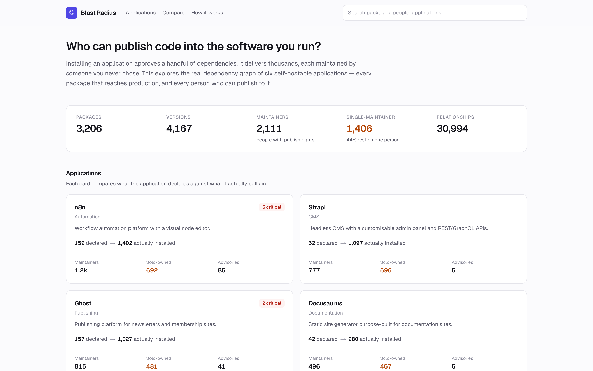
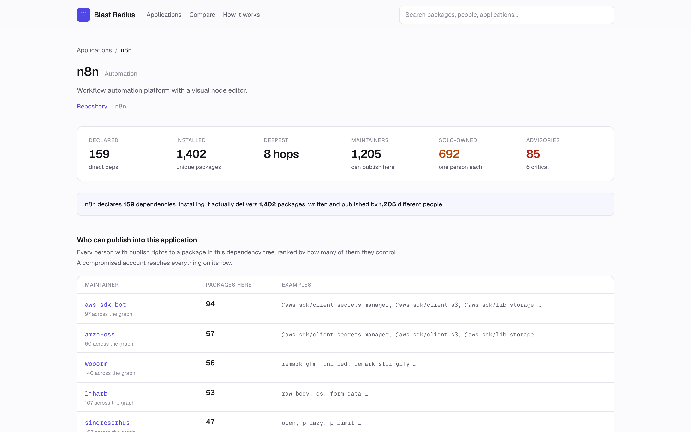
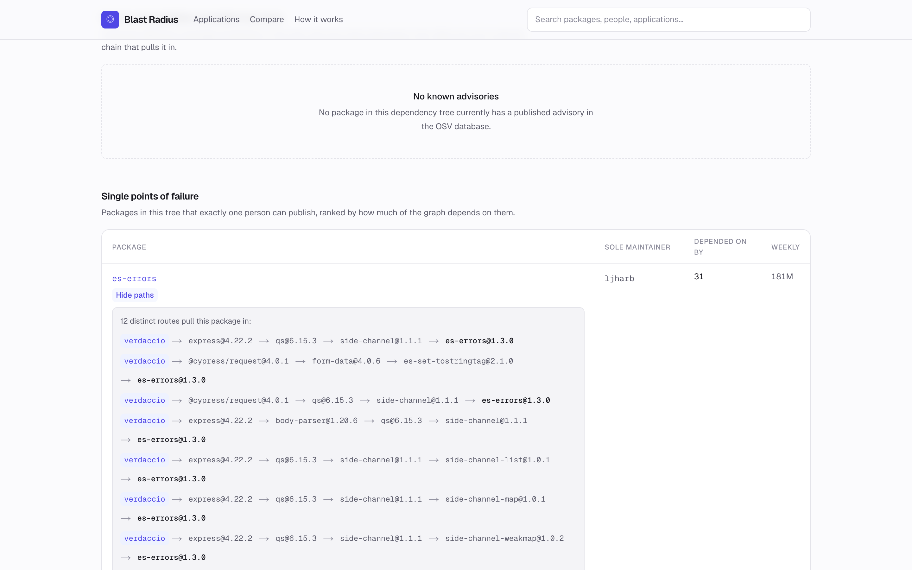
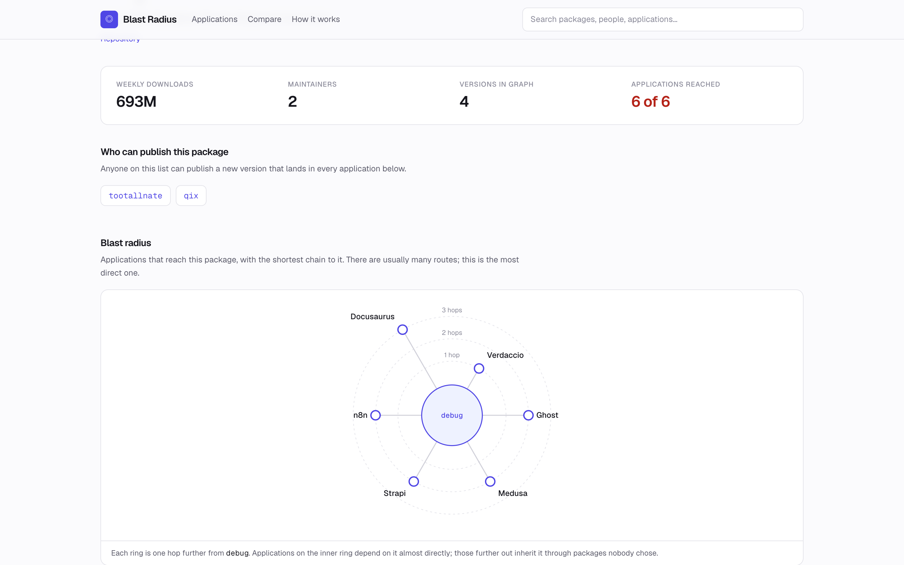
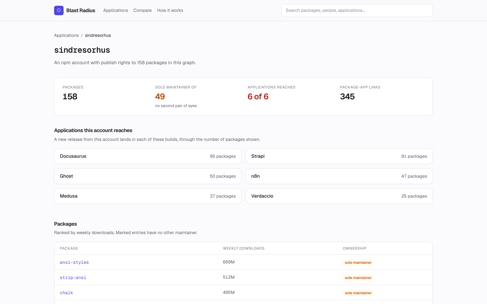
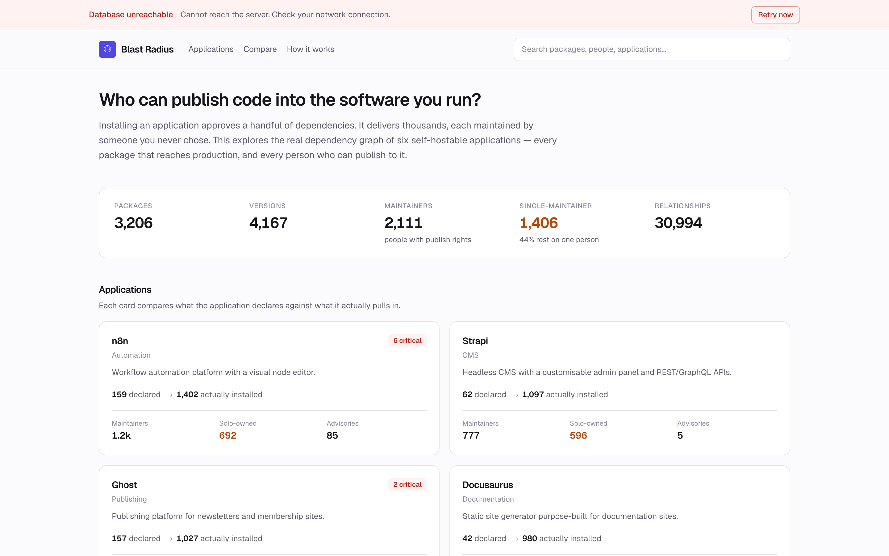
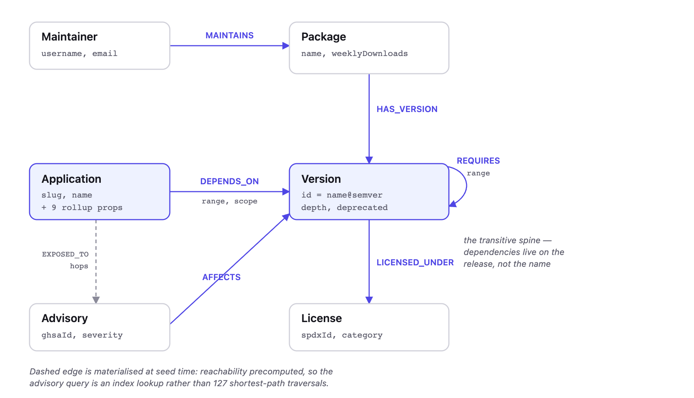
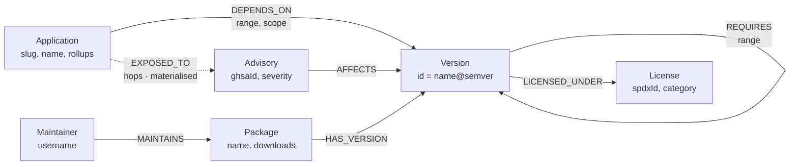

# Blast Radius

**Who can publish code into the software you run?**

You install an application. It declares a few dozen dependencies. You actually
receive thousands, each published by someone you never chose. Blast Radius maps
the real dependency graph of six self-hostable applications and answers the
questions that follow: who can push code into this, which packages rest on a
single person, what is vulnerable, and — crucially — *by exactly what chain did
this arrive?*

- **Live demo:** https://wexa-jade.vercel.app
- **Screen recording:** _(to be added)_
- **Data:** the public npm registry and [OSV.dev](https://osv.dev). Nothing synthetic.
- **Database:** CognoDB (openCypher over Bolt 5.4)

---

## The problem, concretely

Verdaccio declares **31** dependencies. Installing it delivers **298 packages**.

One of them is `ms`, a tiny helper that turns `"2 days"` into a number of
milliseconds. Verdaccio's authors never asked for it. It arrives by five
separate routes:

```
verdaccio → debug@4.4.3 → ms@2.1.3
verdaccio → express@4.22.2 → send@0.19.2 → ms@2.1.3
verdaccio → @verdaccio/url@13.1.2 → debug@4.4.3 → ms@2.1.3
verdaccio → @verdaccio/auth@8.1.2 → debug@4.4.3 → ms@2.1.3
verdaccio → @verdaccio/hooks@8.1.3 → debug@4.4.3 → ms@2.1.3
```

Whoever controls `ms` can publish code that runs on your server the next time
you deploy. Now scale it up — four real accounts from this dataset:

| npm account | Applications reached | Packages controlled | No second reviewer |
|---|---:|---:|---:|
| `sindresorhus` | **6 of 6** | 158 | 49 |
| `ljharb` | **6 of 6** | 107 | 48 |
| `dougwilson` | **6 of 6** | 57 | 9 |
| `isaacs` | **6 of 6** | 39 | 27 |

One password. Six production applications. This is not hypothetical:
`event-stream` was handed to a stranger who volunteered to maintain it and
shipped a wallet stealer to two million weekly downloads.

**In one line:** this is `npm why` and `npm owner ls`, with a UI, backed by a graph.

---

## Why a graph database?

Three properties of this problem that a relational schema handles badly.

### 1. Depth is unbounded and unknown at query time

Real trees here run to depth 8. You cannot write the joins in advance because
you do not know how many there will be. Every question becomes a recursive CTE.

### 2. The path *is* the answer

"Is `ms` reachable from Verdaccio?" is answerable in SQL. "Show me the five
chains that make it reachable" is what a person needs in order to act.

```cypher
MATCH path = (app:Application {slug: $slug})-[:DEPENDS_ON|REQUIRES*1..5]->(target:Version)
RETURN [n IN nodes(path) | coalesce(n.id, n.slug)] AS chain
```

The relational equivalent must carry an accumulating path array through the
recursion and parse it back out afterwards:

```sql
WITH RECURSIVE reachable(id, chain, depth) AS (
  SELECT v.id, a.slug || ' → ' || v.id, 1
  FROM app_depends a JOIN versions v ON v.id = a.version_id
  WHERE a.app_slug = $1
  UNION ALL
  SELECT r2.to_id, reachable.chain || ' → ' || r2.to_id, depth + 1
  FROM reachable
  JOIN requires r2 ON r2.from_id = reachable.id
  WHERE depth < 5 AND position(r2.to_id in reachable.chain) = 0  -- cycle guard
)
SELECT chain FROM reachable WHERE id LIKE 'ms@%';
```

String concatenation as a data structure, plus a manual cycle guard, to
reproduce what `nodes(path)` gives natively.

### 3. The interesting patterns cross relationship types

The headline query walks `REQUIRES` to unknown depth, then steps **sideways**
onto `MAINTAINS` — a different relationship, traversed in the opposite
direction — and aggregates by person:

```cypher
MATCH (a:Application {slug: $slug})-[:DEPENDS_ON|REQUIRES*1..5]->(v:Version)
MATCH (p:Package)-[:HAS_VERSION]->(v)
MATCH (m:Maintainer)-[:MAINTAINS]->(p)
WITH m, collect(DISTINCT p.name) AS packages
```

In SQL the transitive closure must be fully materialised before the join to the
maintainer table can begin. In Cypher the sideways hop costs nothing extra.

### Where a graph does *not* earn its place

Worth stating plainly: the dashboard counters are ordinary aggregates. They are
precomputed at seed time precisely because asking the graph to compute them
live was the wrong tool — see [Performance](#performance). Knowing where the
boundary is matters more than pretending there isn't one.

---

## Screenshots

### Dashboard — what each application declares, versus what it installs



### Who can publish into this application (Q2)

Every account with publish rights to a package in the tree, ranked by how many
of them it controls.



### "Why is this here?" (Q5)

`es-errors` has one maintainer and 181M weekly downloads. Verdaccio never asked
for it — it arrives by twelve distinct routes.



### Blast radius — applications placed on rings by hop distance



### One npm account, everything it reaches



### Graceful degradation when the database is unreachable



> Regenerate with `npm run screenshots` while a production build is running.

## Data model



<details>
<summary>Same diagram as Mermaid source</summary>



</details>

| Nodes | | Relationships | |
|---|---:|---|---:|
| Package | 3,206 | MAINTAINS | 11,459 |
| Version | 4,167 | REQUIRES | 10,442 |
| Maintainer | 2,111 | HAS_VERSION | 4,167 |
| Advisory | 127 | LICENSED_UNDER | 4,118 |
| License | 39 | DEPENDS_ON | 522 |
| Application | 6 | AFFECTS | 149 |
| | | EXPOSED_TO | 137 |
| **Total** | **9,656** | **Total** | **30,994** |

### The modelling decision worth explaining

**Dependency edges hang off `Version`, not `Package`.** A package does not
depend on anything — a specific release does. `lodash` has no dependencies;
`lodash@4.17.20` does. Resolving to one concrete version per package at seed
time mirrors what a lockfile produces and what actually ships.

`MAINTAINS` deliberately stays at the `Package` level, because maintainers own
the *name* across all releases.

**The cost:** it adds a hop — package to package means
`Package → Version → Version → Package`. **Why it is worth paying:** the
alternative cannot express *"you are on 4.17.20, which is vulnerable, but
4.17.21 is patched."* Advisories are version-scoped in reality, so the model
has to be too.

---

## The main queries

All in [`src/lib/queries/`](src/lib/queries/). Every one is a static Cypher
string with values passed as parameters — nothing is concatenated. Timings are
measured against the live free-tier instance via `npm run db:smoke`.

| Query | Answers | Time |
|---|---|---:|
| **Q1** `getBlastRadius` | If this package is compromised, which applications are hit, and by the shortest route? | 2,612ms |
| **Q2** `getMaintainerExposure` | **Who can publish code into this application?** | 3,778ms |
| **Q3** `getSoloMaintainedPackages` | Which packages rest on exactly one person? | 906ms |
| **Q4** `getReachableAdvisories` | Which known vulnerabilities are reachable from here? | 871ms |
| **Q5** `getDependencyPaths` | **Why is this package here at all?** | 814ms |
| **Q6** `getLicenseExposure` | Which non-permissive licences did I inherit? | 1,932ms |
| **Q7** `getSharedExposure` | What do these two applications both depend on? | 2,716ms |

Plus `listApplications`, `getApplication`, `getPackage`,
`getPackageNeighbourhood`, `getGraphStats`, `search` and `getMaintainerDetail`.

### Q2 — shared-maintainer exposure (multi-hop, crosses relationship types)

Traverses `REQUIRES` to unknown depth, hops onto `MAINTAINS`, aggregates by
person. This is the query a relational database finds awkward: the closure must
be materialised before the join can start.

### Q5 — "why is this here?" (the one SQL cannot express naturally)

Returns *every* distinct route from an application to a package, not one. The
answer is a set of paths of differing lengths — see the `ms` example above.

### Q4 — a deliberate exception

Q4 does **not** traverse. Computing advisory reachability live meant one
`shortestPath` per advisory, 127 times: **11,678ms**. The seed-time
breadth-first sweep already knows the answer, so it is materialised as
`(Application)-[:EXPOSED_TO {hops}]->(Advisory)` and read back as an index
lookup — **871ms, a 13× improvement**. The explanatory path loads on demand for
the one advisory a user opens.

---

## Setup

### 1. Create a CognoDB instance

1. Sign up at [console.cognodb.com/signup](https://console.cognodb.com/signup) —
   the free tier needs no credit card.
2. Create a free **c0** instance and pick a region. It provisions in under a
   minute.
3. Copy the connection URI (`bolt+s://<instance-id>.databases.cognodb.com`) and
   the generated password for user `cognodb`. **The password is shown exactly
   once** — save it immediately.

### 2. Configure

```bash
git clone <this-repo> && cd blast-radius
npm install
cp .env.example .env
```

Fill in `.env`:

```ini
COGNODB_URI="bolt+s://<instance-id>.databases.cognodb.com"
COGNODB_USER="cognodb"
COGNODB_PASSWORD="<your password>"
```

`.env` is gitignored. Only `.env.example` is committed, and its password field
is empty.

### 3. Load the graph

```bash
npm run db:check     # verify connectivity — prints the Bolt protocol version
npm run db:schema    # 6 uniqueness constraints + 3 indexes
npm run seed:load    # load data/snapshot.json  (~2 minutes)
```

`data/snapshot.json` is **committed**, so seeding needs no network access and
is not subject to npm rate limits. The loader is idempotent — running it twice
produces identical counts.

To rebuild the snapshot from live sources instead (~39 minutes cold, ~2 minutes
with the on-disk cache):

```bash
npm run seed:fetch
```

### 4. Run

```bash
npm run dev          # http://localhost:3000
```

### Deploying

Deploy to Vercel and set `COGNODB_URI`, `COGNODB_USER` and `COGNODB_PASSWORD`
as environment variables in the dashboard — `.env` is not committed, by design.

> **Bolt is a raw TCP protocol and cannot run on Vercel's Edge runtime.** Every
> route that touches the database declares `export const runtime = "nodejs"`.
> This is the most likely cause of a deploy that works locally and fails in
> production.

---

## Architecture

```
src/app/          routes — RSC pages + 3 API handlers
src/components/   UI primitives, search, connection banner, SVG diagram
src/lib/db/       driver singleton · session helpers · error normalisation
src/lib/queries/  one typed function per question
src/lib/api/      error → HTTP mapping
scripts/          schema · seed pipeline · connection check · smoke test
```

Pages call the query layer directly as Server Components. API routes exist only
where the client genuinely needs to fetch — search-as-you-type and on-demand
path loading. **Nothing reaches the driver except through
[`src/lib/db/session.ts`](src/lib/db/session.ts)**, which takes a static Cypher
string plus a params object.

**Connection pooling.** The driver is a module-scoped singleton, not
per-request — it owns a TCP pool, and constructing one per request leaks
sockets. The pool is capped at **10** because each warm serverless instance
holds its own and the free tier allows 200 connections total.

**Error handling splits two ways.** `DatabaseUnavailableError` produces a 503
with `Retry-After`, a persistent banner and a working retry button.
`QueryFailedError` produces a 500 and no retry. That distinction is what makes
"graceful error handling" visible rather than merely claimed.

**Configuration** is validated once by Zod at first access
([`src/lib/env.ts`](src/lib/env.ts)) and fails with a message naming each
missing variable, not a driver stack trace.

---

## Performance

Traversal depth is bounded at 5. That number came from measurement, not taste:

| Depth | Reachable versions | Q2 time | Q2 top result |
|---:|---:|---:|---:|
| 2 | 676 | 438ms | 43 packages |
| 3 | 1,188 | 801ms | 89 |
| 4 | 1,509 | 1,545ms | **94** |
| 5 | 1,653 | 3,933ms | 94 |
| 6 | 1,725 | 12,236ms | 94 |

**Cost grows ~2.5× per hop while the answer converges at depth 4** — a
variable-length pattern enumerates every *path*, not every reachable *node*,
and n8n reaches `debug` by 476 distinct routes.

So exact, unbounded totals are computed **outside** the database:
[`scripts/seed/rollups.ts`](scripts/seed/rollups.ts) sweeps the snapshot's edge
lists breadth-first, visiting each node once instead of walking every path into
it, and writes the results as properties on the `Application` nodes. The
dashboard therefore reads precomputed values; only exploration traverses.

### CognoDB dialect notes

Four behaviours found by running code, all of which shaped the query layer:

1. **Traversal bounds cannot be parameters.** `*1..$depth` is a syntax error, so
   bounds are literals. Values remain parameters throughout.
2. **Aggregating inside a map literal nulls the non-aggregated fields.**
   `RETURN { name: p.name, xs: collect(m) }` yields `name: null`. Aggregate in a
   `WITH` first.
3. **`ORDER BY` on a map field silently does not sort.** No error, plausible
   output, wrong order. Order on plain variables before building the map.
4. **Binding an already-matched node into a second traversal exceeds the server
   deadline.** Q7 therefore runs two independent bounded traversals and
   intersects them in the application layer.

---

## Known limitations

- **`notFound()` returns HTTP 200 on Next 16.3.2.** The correct page renders;
  only the status line is wrong. Not caused by ISR or streaming — both ruled out
  by testing. Unmatched routes do return 404.
- **Traversals are bounded at 5 hops.** Deeper data exists in the graph and is
  reflected in the precomputed totals, but interactive views do not show it.
- **Bot accounts are listed alongside humans.** `aws-sdk-bot` tops n8n's
  exposure list. Arguably correct — an automation account with publish rights is
  real risk — but the UI should distinguish them.
- **Maintainers are "who can publish today", not history.**
- **Weekly downloads are a point-in-time snapshot** taken at seed time.

---

## Commands

| Command | Purpose |
|---|---|
| `npm run db:check` | Verify connectivity, print Bolt version |
| `npm run db:schema` | Apply constraints and indexes |
| `npm run seed:fetch` | Rebuild `data/snapshot.json` from npm + OSV |
| `npm run seed:load` | Load the snapshot into CognoDB (idempotent) |
| `npm run db:smoke` | Run all 14 queries and print timings |
| `npm run dev` / `build` | Develop / production build |
| `npm run lint` / `typecheck` | Static checks |

Further reading: [`docs/walkthrough.md`](docs/walkthrough.md) covers every
design decision, its alternatives, and the measurements behind it.

---

## Tech stack

Next.js 16 (App Router, React Server Components) · TypeScript · Tailwind CSS 4 ·
`neo4j-driver` 6 over Bolt 5.4 · Zod · CognoDB.

Production dependencies: five. The blast-radius diagram is hand-rolled inline
SVG rather than a graph library — the layout is deterministic, so a force
simulation would have added a client bundle to arrange six points on a circle.
